# Nacos注册中心的安装

是阿里巴巴的产品，目前已经是springcloud的组件了

### 下载安装包

进入[github](https://github.com/alibaba/nacos)下载，进入右侧releases：

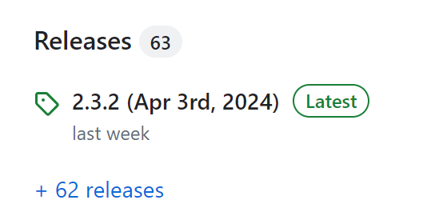


选择tags：


选择版本（教程选的1.4.1）：

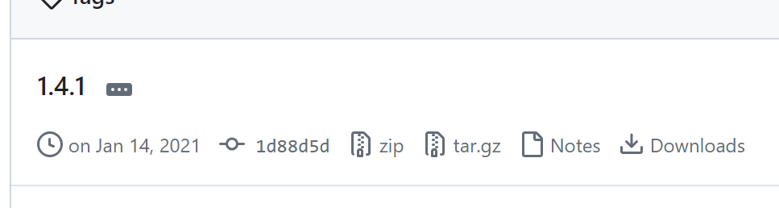

### 端口检查

解压到非中文路径，先查看端口8848是否被占用

```bash
netstat -ano | findstr "8848"
```

如果被占用，需要进入nacos的conf目录，修改配置文件application.properties中的端口。

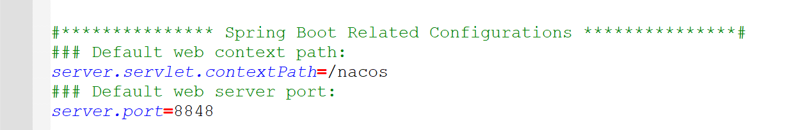

### 启动nacos

终端进入bin文件夹，输入命令

```bash
.\startup.cmd -m standalone
```

效果：

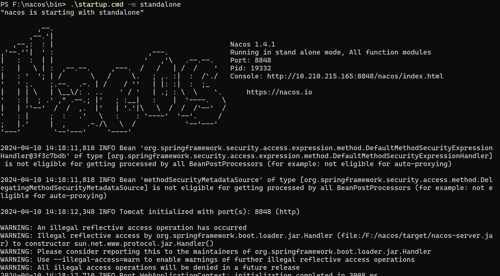

### 进入控制台

ctrl键访问上图中，打印图案右侧的`Console: http://10.210.215.165:8848/nacos/index.html` 

浏览器被启动：


输入用户名和密码，默认都是`nacos` ，点击提交后，进入控制台：

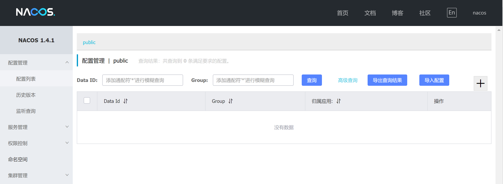


# nacos服务注册与服务发现

### 依赖的添加和修改

父工程里需要添加nacos相关的依赖，因为是对子工程的管理，所以需要放在`dependencyManagement` 标签内的`dependencies` 内：

```
<!-- nacos -->
<dependency>
    <groupId>com.alibaba.cloud</groupId>
    <artifactId>spring-cloud-alibaba-dependencies</artifactId>
    <version>2.2.5.RELEASE</version>
    <type>pom</type>
    <scope>import</scope>
</dependency>
```

子工程里需要用nacos替代eureka，即把eureka的依赖注释掉，添加nacos的依赖：

```xml
        <!--eureka客户端依赖-->
<!--        <dependency>-->
<!--            <groupId>org.springframework.cloud</groupId>-->
<!--            <artifactId>spring-cloud-starter-netflix-eureka-client</artifactId>-->
<!--        </dependency>-->
        <!-- nacos客户端依赖包 -->
        <dependency>
            <groupId>com.alibaba.cloud</groupId>
            <artifactId>spring-cloud-starter-alibaba-nacos-discovery</artifactId>
        </dependency>
```

### 修改配置文件

原本配置文件里是对eureka的配置，现在需要换成nacos，所以需要先把对eureka的配置注释掉：
```xml
#eureka:
#  client:
#    service-url:
#      defaultZone: http://127.0.0.1:12345/eureka
```

然后添加eureka的配置，它属于spring的配置，所以加在`spring:` 下面：

```xml
spring:
  cloud:
    nacos:
      server-addr: localhost:8848
```

如下图所示，可以看到端口默认也是8848，所以这里其实可配可不配，但最好还是配上，便于将来修改

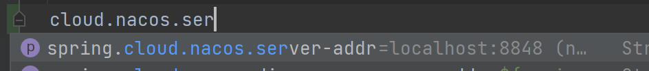

备注：每个子工程（这个案例中是order和user，eureka不要写，因为我们已经不用它了）都要完成**依赖修改**和**配置文件**的修改

### 项目，启动！

先按照前面的步骤，启动nacos。

再在idea中启动服务，eureka此时不用再启动了：

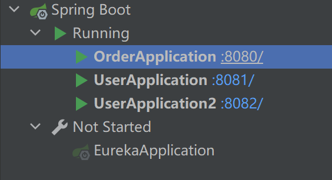

打开nacos的控制台，可以看到目前启动的三个服务：

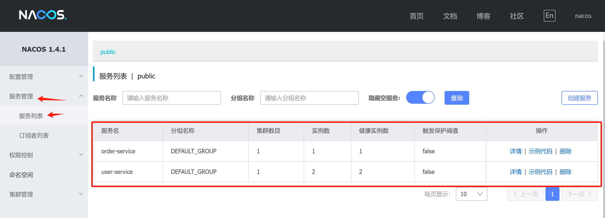

可以点开详情看到集群具体包含的所有实例，这里点击user-service的详情看看：

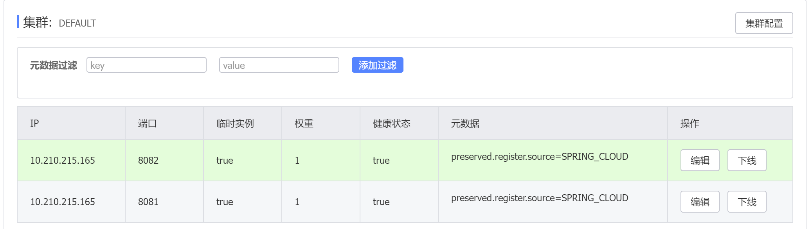

测试访问`http://localhost:8080/order/102` ，正确输出了包含user信息的结果：

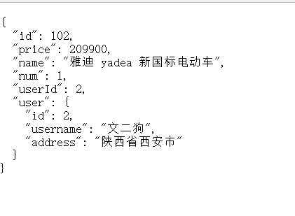

可以看到日志，UserApplication2服务实例被调用了：
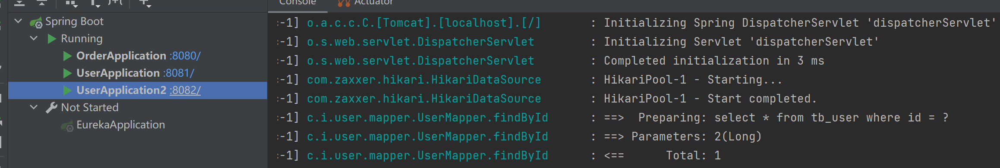

也就是说，服务发现部分和eureka还是一样的，不需要修改，服务注册只需要添加依赖和application配置一下端口号就行了

# 服务分级存储模型

看一下下面这张视频教程的截图，可以看到集群也会被再次划分，比如我之前案例里有一个User的集群，只包含两个实例，此时可以说User服务只有一个服务集群，但是在实际情况中，甚至能同时存在多个集群，比如在A地有一个User的集群（包含10个实例）、B地有一个User的集群（包含8个实例）这样子。

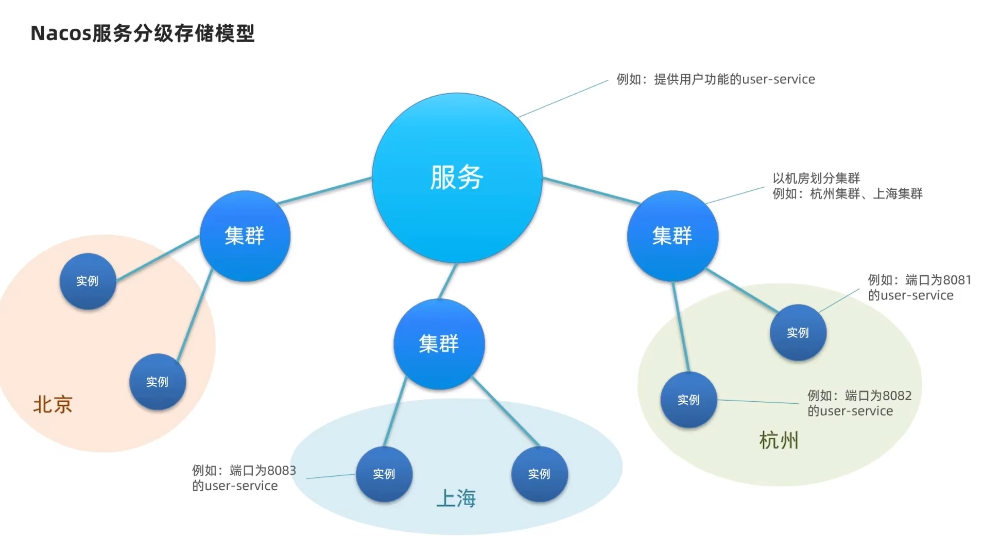

那么此时会存在集群调用的不同情况，

### 模拟User实现多个集群

application中增加集群的配置cluster-name：

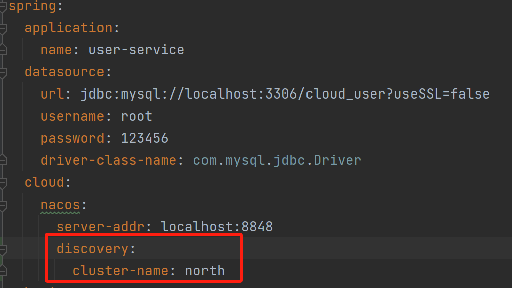

首先配置为south，然后启动UserApplication和UserApplication2.

然后配置为north，然后启动UserApplication3（这里新建了一个，之前实验没有新建它）。

每次启动时，会使用当前的application，所以最后一个服务实例属于north集群，前两个属于south，效果如下图所示：

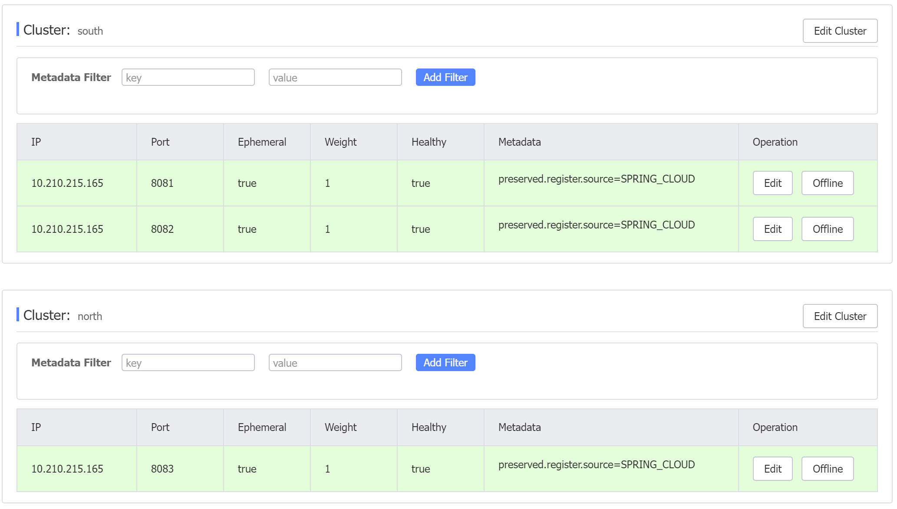

如果不配置这个cluster-name属性，所有启动的服务实例都会放在default下面

### 配置order的服务集群

假设配置到south集群：

```yml
discovery:
  cluster-name: south
```

效果：

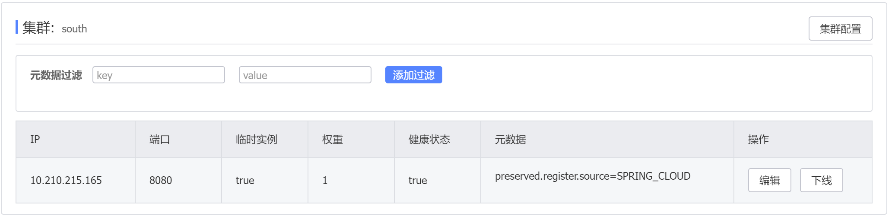

配置负载均衡方式：

```yml
# 根据集群配置负载均衡
user-service:
  ribbon:
    NFLoadBalancerRuleClassName: com.alibaba.cloud.nacos.ribbon.NacosRule
```

接下来需要观察order调用user时，是否会优先本地的集群（即south集群）

我测试了5次，有两次UserApplication，三次UserApplication2，而位于其他集群的UserApplication3并没有被访问过。

如果去掉最后一步的配置复杂均衡方式，还是会三个服务实例都被访问。

当前配置的效果是：优先访问本地集群，在本地集群中通过随机方式实现负载均衡。

另外，如果停掉south集群的UserApplication和UserApplication2，再使用oeder，发现它会调用UserApplication3，并且发出跨集群的警告：

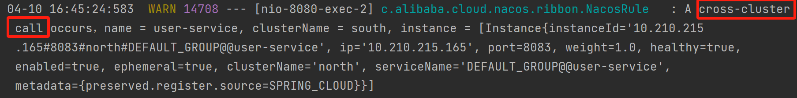

也就是说，本地集群无法提供服务时，还是会通过跨集群实现。

### 解决本地集群内部的随机选取

不同服务器的性能不同，希望能人为修改选取时的偏重，即赋予权重，权重越高，访问频率更高一点。

打开nacos控制台，修改实例的权重，假设修改UserApplication的权重为0.1（点击操作中的编辑），此时会优先对UserApplication2访问，：

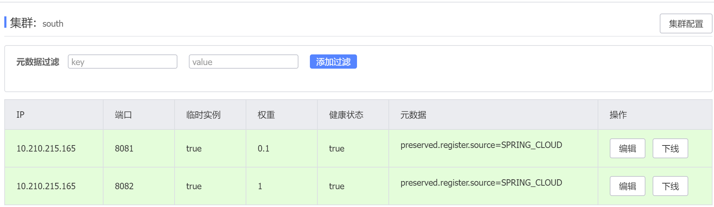

我测试20+次，效果是UserApplication只被访问两次，可以看到权重配置的效果。

另外，如果权重被调为0的话，一次都不会被调用。（如果同时还关掉UserApplication2，那么order宁愿去跨集群调用UserApplication3，也不会调用它）

这是一种服务器维修的办法，调成0后，不会新增访问用户，用户量会逐渐下降至没有，此时对服务器进行维修，等到维修结束后，慢慢增加权重，一开始只放少量用户进来，测试一下性能，如果效果不错的话，再继续增加。

# 环境隔离

通过放在不同的命名空间实现，不同命名空间的实例是不能互相访问的，所以就被隔离了。具体做法如下：

新建命名空间：

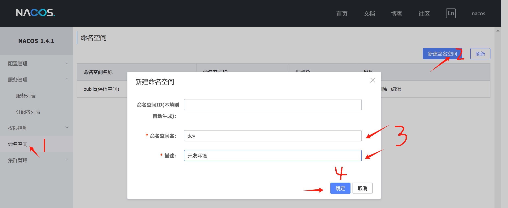

效果：

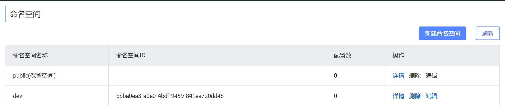

复制命名空间ID。打开order服务的application文件，配置命名空间为刚刚复制的ID：

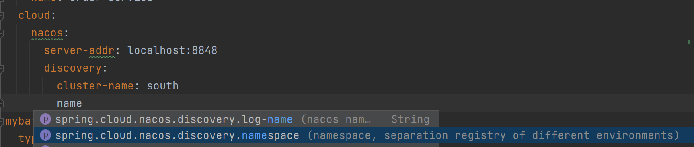

重启order服务，此时public命名空间只有user了，dev命名空间出现了order。

public：

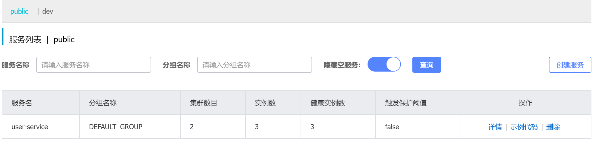

dev：

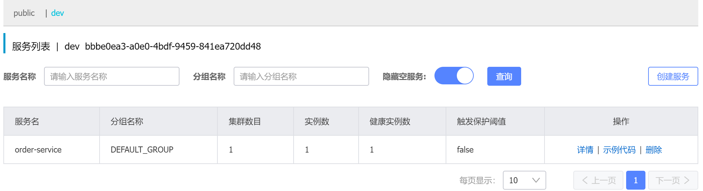

此时运行`http://localhost:8080/order/102` 报错找不到实例：
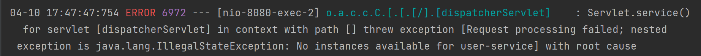

实现了环境隔离。

# 对比nacos和eureka

### 针对临时实例与非临时实例

nacos默认所有实例都是临时实例，临时实例和注册中心的交互和eureka一样，定时发送心跳包。

如果配置实例为非临时实例，将由nacos主动询问服务实例是否还活着，不再需要实例主动发送心跳包，如果实例死了，也不会被注册中心删掉，而是等待它活过来。

下面开始配置非临时实例，打开application文件，配置ephemeral为false：


```yml
spring:
  cloud:
    nacos:
      discovery:
        ephemeral: false
```

效果，此时临时实例是false：

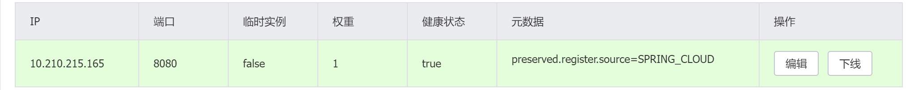

再在idea停止它：

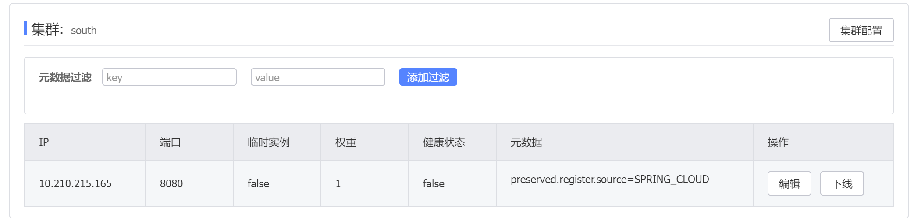

nacos报红：

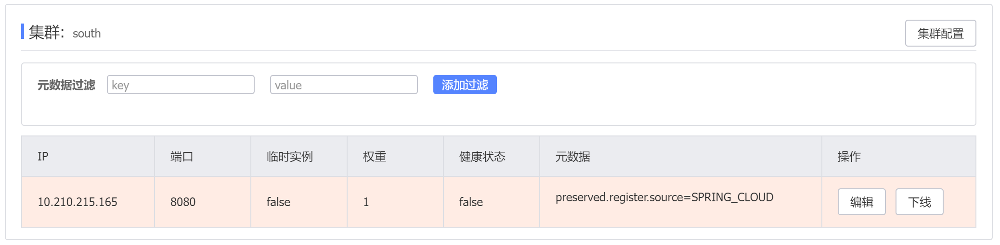

此时nacos不会把它删掉，这些非临时实例只能手动删除，否则永远都会在。

如果是临时实例被终止了，nacos终端界面刷新后，这些临时实例会被删掉。

补充说明：临时实例会使得注册中心的压力比较大，更推荐临时实例。

### 其他区别

1. nacos支持服务列表变更时主动推送，eureka不支持。

2. nacos默认采用AP方式，当集群中存在非临时实例时采用CP模式，eureka采用AP方式。补充CAP定理：

   - 
C（一致性）：分布式环境下，一份数据往往有多个数据副本，这些数据副本要求在同一时刻的值相同。

   - A（可用性）：当集群中的某些节点出现故障、不能响应请求的时候，集群中的其他正常工作的节点依然能够正常提供服务。
   - P（分区容错性）：分布式系统中某个节点或者网络分区出现故障、区间通信失败的情况下（即网络不可靠，导致系统的一部分节点与系统的其他部分节点之间失去通信能力），要保证其他节点能够继续对外提供服务。意味着系统能够容忍任何数量的消息丢失或延迟，不会因为网络故障而完全停止工作。
     	