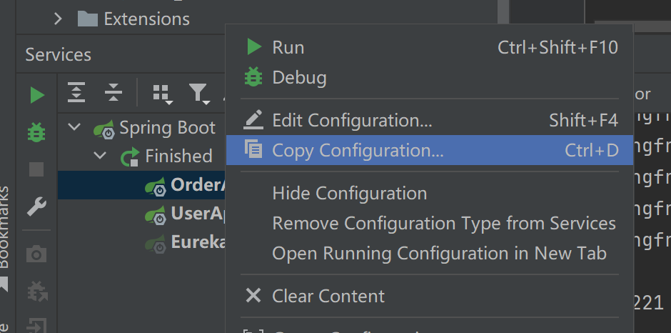

## 服务远程调用RestTemplate

#### 问题说明：

目前有两个服务，需要实现order服务调用user服务，获取它的用户信息：


#### 实现方法：

1. **order服务中写一个@Bean：**

   ```java
   @Bean
       public RestTemplate restTemplate(){
           return new RestTemplate();
       }
   ```

   可以新建一个@Configuration，也可以直接再application中写，因为它本身也是一个@Configuration

2. **注入到需要user的controller，并通过getEntity获得用户信息**

   ```java
   @RestController
   @RequestMapping("order")
   public class OrderController {
   
      @Autowired
      private OrderService orderService;
      @Autowired
      private RestTemplate restTemplate;
   
       @GetMapping("{orderId}")
       public Order queryOrderByUserId(@PathVariable("orderId") Long orderId) {
           // 根据id查询订单并返回
           Order order=orderService.queryOrderById(orderId);
           String url="http://localhost:8081/user/"+order.getUserId();
           order.setUser(restTemplate.getForObject(url, User.class));
   
           return order;
       }
   }
   ```

   这里需要手动写好url（其中8081是user服务的端口号），且传入这一次get请求的相关参数。

#### 实现效果

通过访问order服务的`http://localhost:8080/order/{orderId}` ，可以得到包含user信息的结果，其中8080是order服务的端口号。


## 搭建Eureka服务

#### 创建并配置eureka-server

1. **new module：**

   

2. **添加依赖**

   ```xml
           <dependency>
               <groupId>org.springframework.cloud</groupId>
               <artifactId>spring-cloud-starter-netflix-eureka-server</artifactId>
           </dependency>
   ```

3. **启动类**

   ```java
   @EnableEurekaServer
   @SpringBootApplication
   public class EurekaApplication {
       public static void main(String[] args) {
           SpringApplication.run(EurekaApplication.class,args);
       }
   }
   ```

   相比于SpringBoot项目，这里还需要打开eureka的自动装配，所以需要`@EnableEurekaServer`。

4. **配置application**

   ```yml
   server:
     port: 12345
   
   spring:
     application:
       name: eureka-server
   eureka:
     client:
       service-url:
         defaultZone: http://127.0.0.1:12345/eureka
   
   ```

   配置server.port之前，需要查询一下端口是否已被占用：`netstat aon | findstr :12345`

   另外，补充说明以下端口号，端口号的范围是从1到65535。但是，并不是所有端口号都建议使用：

   1. **0-1023**: 这些是所谓的"知名端口"（Well-Known Ports），通常被操作系统或特定的系统服务占用。例如，HTTP服务通常使用端口80，HTTPS使用443。非管理员用户可能没有权限绑定这些端口。
   2. **1024-49151**: 这些是"注册端口"（Registered Ports），用于特定的服务。虽然有些端口在这个范围内是未被官方使用的，但最好避免使用常见的服务端口，比如MySQL默认端口3306，以避免冲突。
   3. **49152-65535**: 这些是"动态和/或私有端口"（Dynamic and/or Private Ports），通常用于临时通信端口。这些端口较少被系统服务占用，是为服务设定端口时的理想选择。

#### 实现效果


红色圈出来的是重点，代表已经在eureka注册的实例，目前还只有它自己被注册了，所以这里只有一个，它的名称就是我们在application中配置的名称`spring.application.name`。


## 实现Eureka服务注册

#### 将user和order服务添加到Eureka注册中心

1. **添加依赖**

   打开两个服务的pom文件，均添加依赖：

   ```xml
           <!--eureka客户端依赖-->
           <dependency>
               <groupId>org.springframework.cloud</groupId>
               <artifactId>spring-cloud-starter-netflix-eureka-client</artifactId>
           </dependency>
   ```

   注意这里添加的是client，对于注册中心来说，所有的服务都是它的client，服务端和客户端的概念是相对的，这些服务对于用户来说是服务端，但是对于注册中心来说，是客户端，这里添加的依赖也是client。

2. **配置application文件**

   同样的，两个服务的application都要添加下述内容，注意spring配置的合并

   ```yml
   spring:
     application:
       name: user-service
   eureka:
     client:
       service-url:
         defaultZone: http://127.0.0.1:12345/eureka
   ```

   就是两个操作：命名和注册

#### 实现效果

刷新`http://localhost:12345/` ，可以看到：


第一个是eureka注册中心本身，下面两个为本次添加的order和user两个服务。

## 启动多个服务实例

### 相关说明

在上一个案例中，只启动了一个服务实例，事实上，我们可以启动多个服务实例，这样做的主要目的是为了实现负载均衡和高可用性等。负载均衡之类的还没学到，简单总结一下：

1. **负载均衡**：当有大量的请求发送到`ORDER-SERVICE`或`USER-SERVICE`时，如果只有一个实例可能会导致响应变慢，通过运行多个实例可以将请求分散到不同的实例上，从而提高处理能力和响应速度。
2. **高可用性**：如果某个服务的唯一实例出现故障，那么该服务就会完全不可用。但如果有多个实例，一个实例的故障不会影响到整个服务，其他实例仍然可以处理请求。
3. **故障转移和冗余**：在一个实例失败时，Eureka可以自动将流量重新路由到健康的实例上，这样就提供了故障转移支持。
4. **灵活的扩展**：随着应用负载的增加，可以动态增加服务实例来应对更高的负载，也可以在负载降低时减少实例数量以节省资源。

当一个服务需要调用另一个服务时，它会询问Eureka服务器该调用哪个实例。Eureka返回一系列可用的服务实例，然后客户端服务中的负载均衡器会根据某种策略选择一个实例。这个选择过程通常是自动的，对于开发者来说是透明的。

另外，每个服务实例并不一定需要在不同的服务器上。一个服务器上可以运行多个服务实例，甚至可以运行不同服务的实例，只要资源允许。

### 下面是实现方法

打开Service试图，右键一个服务，点击Copy Configuration：



修改name和VM options，必须改一个没被用过的端口号：


效果如下图所示，增加了一个服务实例：


运行这些服务：


变成两个：


# 服务发现

原本是使用的RestTemplate直接向url`http://localhost:8081/user/` 发送请求，这是一种硬编码，现在可以根据服务名称从eureka获取url，并通过负载均衡获取服务实例。

### 具体实践步骤如下：

1. 修改url

```java
// 可通过直接http访问
//String url="http://localhost:8081/user/"+order.getUserId();
// 将url改为目标服务名
String url="http://user-service/user/"+order.getUserId();
```

2. 配置负载均衡

修改resttemplate的配置bean类，增加`@LoadBalanced`

```java
@Bean
@LoadBalanced
public RestTemplate restTemplate(){
    return new RestTemplate();
}
```

### 补充修改内容

运行前要修改部分小问题：

①上一次实验实现了两个order的服务实例，这次实验改一下，如下图所示：


②order和user的两个服务的mapper层漏了`@Mapper`的注解，需要补上，否则可能报数据库/数据库连接池相关错误。

③如果后面运行失败，说找不到服务实例之类的，可以尝试两个方法：

- `build->Rebuild Project`：


- 启动顺序：EurekaApplication->`OrderApplication`->l两个UserApplication：

  如果先启动`UserApplication`，后启动`OrderApplication`，可能会报错找不到服务实例，这可能是因为`OrderApplication`在启动时就尝试去连接或者发现`UserApplication`的实例，目前我是通过更改启动顺序解决的

### 实验效果

浏览器访问效果


OrderApplication的控制台的日志：

```
04-06 15:26:39:185 DEBUG 19356 --- [nio-8080-exec-5] c.i.order.mapper.OrderMapper.findById    : ==>  Preparing: select * from tb_order where id = ? 
04-06 15:26:39:185 DEBUG 19356 --- [nio-8080-exec-5] c.i.order.mapper.OrderMapper.findById    : ==> Parameters: 103(Long)
04-06 15:26:39:185 DEBUG 19356 --- [nio-8080-exec-5] c.i.order.mapper.OrderMapper.findById    : <==      Total: 1
```

UserApplication的控制台的日志：没产生任何新的日志

UserApplication2的控制台的日志：

```
04-06 15:26:39:197 DEBUG 23020 --- [nio-8082-exec-6] c.i.user.mapper.UserMapper.findById      : ==>  Preparing: select * from tb_user where id = ? 
04-06 15:26:39:197 DEBUG 23020 --- [nio-8082-exec-6] c.i.user.mapper.UserMapper.findById      : ==> Parameters: 3(Long)
04-06 15:26:39:197 DEBUG 23020 --- [nio-8082-exec-6] c.i.user.mapper.UserMapper.findById      : <==      Total: 1
```

所以负载均衡帮我们选择了UserApplication2服务实例，多试验几次可以看到，每次都可能是不同的UserApplication服务实例。

