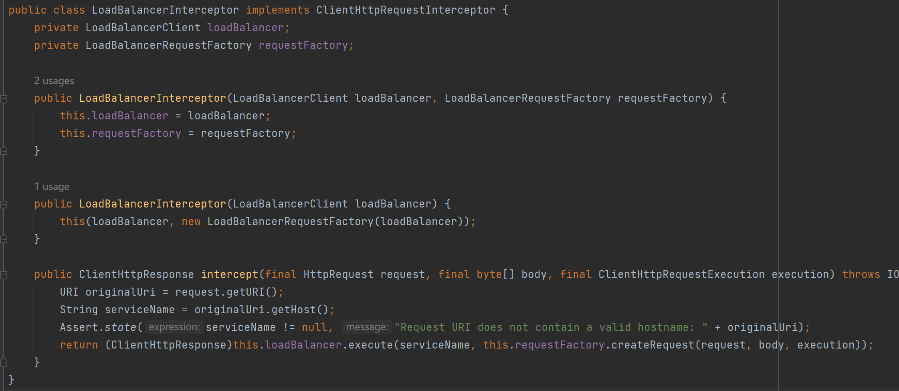
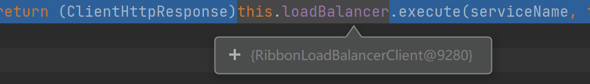
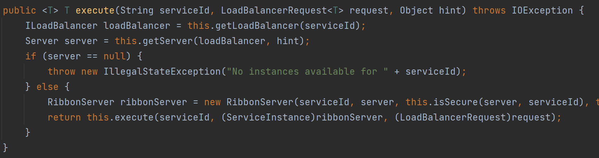
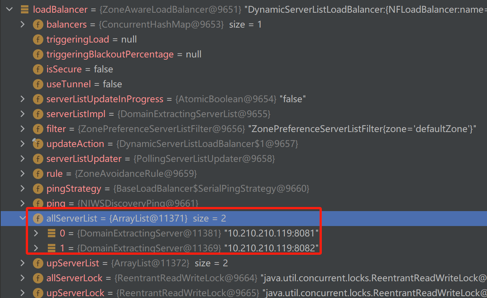
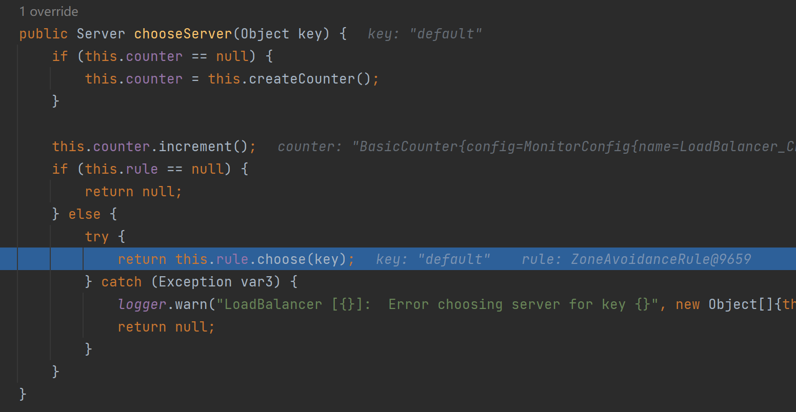
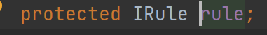
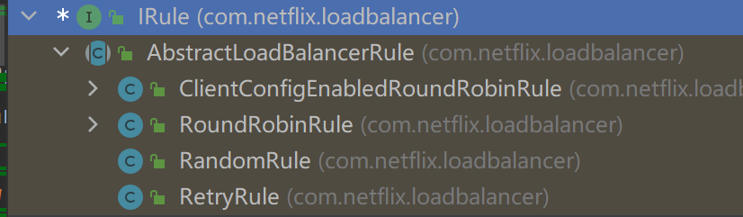
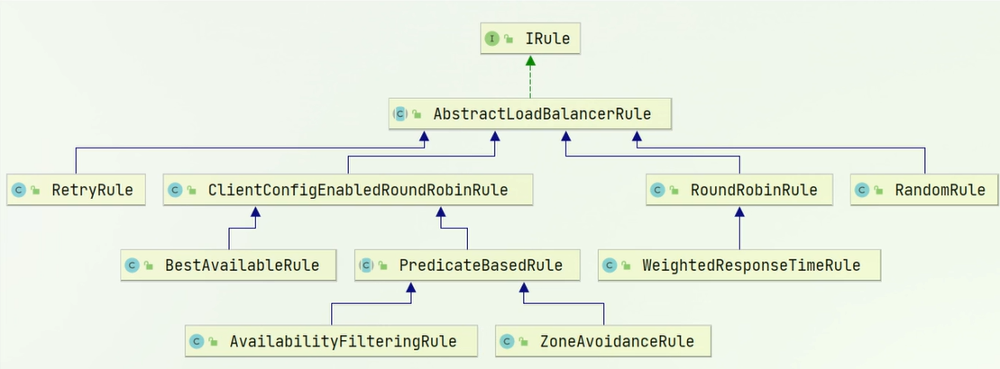

# 负载均衡原理

### 关于拦截器


拦截器（Interceptor）在软件开发中是一种常用的设计模式，特别是在Web开发和分布式系统中。它们允许开发人员定义一些逻辑，这些逻辑可以在特定的点自动执行，例如在一个方法调用之前或之后，或者在一个HTTP请求被处理之前或之后。这种模式使得我们能够在不修改原有代码结构的情况下，对程序的执行或者请求的处理过程进行干预、监控或者修改等。

- **`HandlerInterceptor`** ：这是Spring MVC中用于拦截Web请求的拦截器。你可以使用它来执行一些逻辑，比如认证、授权、日志记录等，在请求到达Controller处理方法之前、之后以及请求完成之后。
  - **preHandle(HttpServletRequest request, HttpServletResponse response, Object handler)**：在请求处理之前调用（即在Controller方法调用之前）。这可以用于执行认证检查、日志记录等。如果这个方法返回`true`，处理流程将继续；如果返回`false` ，则停止处理流程。
  - **postHandle(HttpServletRequest request, HttpServletResponse response, Object handler, ModelAndView modelAndView)**：在请求处理之后调用，但在视图被渲染之前。可以在这里修改模型数据或视图。
  - **afterCompletion(HttpServletRequest request, HttpServletResponse response, Object handler, Exception ex)**：在整个请求处理完成后调用，也就是在视图渲染之后。这可以用于资源清理等后续操作。
- **`ClientHttpRequestInterceptor`** ：用于RestTemplate客户端，拦截HTTP请求。这在调用外部服务或API时特别有用，可以用于添加头信息、日志记录、监控等。
  - **intercept(HttpRequest request, byte[] body, ClientHttpRequestExecution execution)**：在请求被发送前调用。可以操作请求的内容、头信息等。然后，必须调用`execution.execute(request, body)` 以允许拦截器链中的下一个拦截器或最终发送请求。

- 等……


### 关于`LoadBalancerInterceptor`

ctrl+n可以搜索类



它实现了`ClientHttpRequestInterceptor` 接口 ，说明负载均衡的原理能拦截器拦截http请求。

再看一下它的`intercept` 方法：

```java
   public ClientHttpResponse intercept(final HttpRequest request, final byte[] body, final ClientHttpRequestExecution execution) throws IOException {
        URI originalUri = request.getURI();
        String serviceName = originalUri.getHost();
        Assert.state(serviceName != null, "Request URI does not contain a valid hostname: " + originalUri);
        return (ClientHttpResponse)this.loadBalancer.execute(serviceName, this.requestFactory.createRequest(request, body, execution));
    }
```

可以看到执行的过程是：

1. 首先读取URI：`URI originalUri = request.getURI();`

2. 根据URI去读取服务名称：`String serviceName = originalUri.getHost();`

3. 找到eureka，根据服务名称完成服务的拉取:

   

   此时的`loadBalancer` 是一个Ribbon负载均衡客户端，进入这个execute

   

   可以设置端点到`ILoadBalancer loadBalancer = this.getLoadBalancer(serviceId);` ，查看`loadBalancer` 变量：

   

   可以看到allServerList包含了两个服务实例端口号，说明已经根据url获取到了服务列表

   下一步`Server server = this.getServer(loadBalancer, hint);` ，将从所有服务中选择一个服务。

   下面进一步补充一下`getServer` 选择服务的规则：

   同样可以调试，一直step into，最后将进入这个函数：

   

   rule是IRule类型：，I说明是一个接口，IRule说明是一个规则的接口，ctrl+h可以搜索实现类，可以查看它的实现类：

   

   说明：

   - **`ClientConfigEnabledRoundRobinRule`** ：这是一个轮询策略的变种，它使用客户端配置来使得轮询行为更加灵活。
   - **`RoundRobinRule`** ：这是一个简单的轮询策略，它会按顺序逐一调用每个可用的服务实例。
   - **`RandomRule `**：这是一个随机选择规则，它会从所有可用的服务实例中随机选择一个。
   - **`RetryRule `**：这是一个重试机制的规则，如果选定的服务实例失败，它会在一定时间内重试，可能会选择同一个实例，也可能根据内部使用的子规则（如轮询、随机）选择不同的实例。

   将根据这些规则来选择服务实例

# 负载均衡策略

即选取服务的算法，即IRule的实现类，下面仔细看一下



默认情况下`ZoneAvoidanceRule` ，会使用轮询策略，服务实例会被逐一调用，可手动实现策略的修改。

### 手动修改负载均衡策略一：@Bean

配置Bean类即可，以`RandomRule` 策略为例，同样的，选一个配置类写下列代码，启动类本身也是配置类，所以可以在启动类写（之前`RestTemplate` 也是写在这里，一个原理）：B

``` java
    @Bean
    public IRule randomRule(){
        return new RandomRule();
    }
```

会变成随机选取服务实例，这一部分的实验方法为多次调用order服务。

比如我访问了10次`http://localhost:8080/order/103` ，`UserApplication` 被调用了3次，`UserApplication2` 被调用了7次，实现了随机选取，如果使用轮询会各5次

### 手动修改负载均衡策略二：配置文件

直接在application文件中配置，